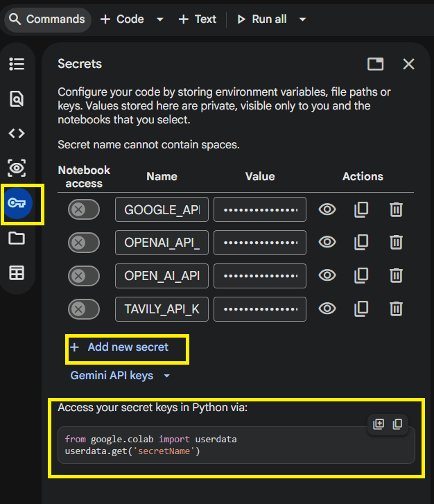

# Agentic-AI

This repository contains a collection of Jupyter Notebook exercises and tutorials focused on building and working with Agentic AI systems. The materials primarily cover concepts using popular frameworks like **LangChain** and **LangGraph**, providing hands-on practice for creating resilient, tool-augmented, and graph-based AI agents. These tutorials are part of Agentic AI course by Sajal Sharma in partnership with O’Reilly

The exercises are located in the `Level_2` and `Level_3` directories and cover various foundational to advanced concepts in Agentic AI:

### Adding secrets in Google Colab

## Level 2
### LangChain Basics & Tooling
* [**`2_1_instantiate_prebuilt_agent.ipynb`**](Level_2/2_1_instantiate_prebuilt_agent.ipynb): Demonstrates how to instantiate prebuilt LangChain agents that can utilize multiple external tools to answer questions.
* [**`2_2_structured_output_tutorial.ipynb`**](Level_2/2_2_structured_output_tutorial.ipynb): Explains how to enforce structured outputs using LangChain and Pydantic to ensure the LLM returns consistent, typed data objects.
* [**`2_3_integrate_tools.ipynb`**](Level_2/2_3_integrate_tools.ipynb): Shows the pattern of augmenting an agent by integrating an external tool, specifically using a Wikipedia search tool as an example.
* [**`2_4_llm_call_chain.ipynb`**](Level_2/2_4_llm_call_chain.ipynb): Covers building progressive LLM call chains (e.g., generation -> summary -> condensation) chaining steps modularly.
* [**`2_12_streaming_output_tutorial.ipynb`**](Level_2/2_12_streaming_output_tutorial.ipynb): Teaches how to implement real-time streaming output using LangChain to display LLM responses chunk-by-chunk as they are generated.
* [**`2_13_async_vs_sync.ipynb`**](Level_2/2_13_async_vs_sync.ipynb): Covers implementing concurrent LLM calls using LangChain's async interface.
* [**`2_14_prompt_templates_tutorial.ipynb`**](Level_2/2_14_prompt_templates_tutorial.ipynb): Covers building reusable prompt templates for various tasks and roles.

### Building ReAct (Reasoning & Acting) Agents
* [**`2_5_write_effective_prompts.ipynb`**](Level_2/2_5_write_effective_prompts.ipynb): Focuses on writing strong system prompts intended to guide the specific behavior and reasoning processes of a ReAct agent.
* [**`2_6_agent_class_structure.ipynb`**](Level_2/2_6_agent_class_structure.ipynb): Explores implementing the core object-oriented class structure required for a ReAct agent to manage state, conversation history, and LLM calls.
* [**`2_6_1_implement_loops.ipynb`**](Level_2/2_6_1_implement_loops.ipynb): Dives into implementing the internal control loop (Thought -> Action -> Observation) that allows a ReAct agent to continually reason until it reaches a final answer.

### LangGraph Fundamentals
* [**`2_7_define_concepts_of_nodes_edges_graphs_and_state_in_langgraph.ipynb`**](Level_2/2_7_define_concepts_of_nodes_edges_graphs_and_state_in_langgraph.ipynb): Introduces the fundamental components of LangGraph: defining Graph State, creating Node functions, creating Edges, and compiling workflows.
* [**`2_8_define_and_manage_state_in_a_langgraph.ipynb`**](Level_2/2_8_define_and_manage_state_in_a_langgraph.ipynb): Deepens state management in LangGraph using Pydantic models with reducers for handling state updates across complex pipelines.
* [**`2_11_construct_a_basic_chatbot_agent_in_langgraph.ipynb`**](Level_2/2_11_construct_a_basic_chatbot_agent_in_langgraph.ipynb): Combines various state and graph concepts to construct a functioning chatbot agent (e.g., a calculator assistant) featuring tools and conditional routing edges.

### Productionization & Resiliency
* [**`2_9_debug_with_logging.ipynb`**](Level_2/2_9_debug_with_logging.ipynb): Explains how to enhance your agents with production-ready structured logging, including tracking tool execution times and summary statistics.
* [**`2_10_error_handling.ipynb`**](Level_2/2_10_error_handling.ipynb): Covers building resilient API structures capable of elegantly handling common LLM pitfalls such as timeouts, rate limits, and fallbacks.
* [**`2_15_guardrails.ipynb`**](Level_2/2_15_guardrails.ipynb): Demonstrates how to implement a layered validation system that combines multiple guardrail checks into a pipeline.
* [**`2_16_create_test_cases.ipynb`**](Level_2/2_16_create_test_cases.ipynb): Focuses on practicing writing test cases for AI agent tools using the Arrange-Act-Assert pattern.
* [**`2_17_performance_metrics.ipynb`**](Level_2/2_17_performance_metrics.ipynb): Teaches how to build a prompt strategy analyzer that tracks performance metrics across different prompting techniques.

## Level 3
### Advanced Agentic Patterns
* [**`3_1_conditional_edges_tutorial.ipynb`**](Level_3/3_1_conditional_edges_tutorial.ipynb): Mastery of dynamic routing and conditional logic in LangGraph.
* [**`3_2_custom_agentic_workflows_tutorial.ipynb`**](Level_3/3_2_custom_agentic_workflows_tutorial.ipynb): Building bespoke agentic state machines with custom transitions.
* [**`3_6_construct_a_plan_and_execute_agent.ipynb`**](Level_3/3_6_construct_a_plan_and_execute_agent.ipynb): Implementing agents that plan complex tasks before execution.
* [**`3_7_deep_agents.ipynb`**](Level_3/3_7_deep_agents.ipynb): Exploring advanced reasoning capabilities and specialized cognitive architectures.
No tried in Colab, need to run in local machine
* [**`3_9_reflection_pattern.ipynb`**](Level_3/3_9_reflection_pattern.ipynb): Building self-correcting agents using generator-reflector loops.

### Debugging & Resiliency
* [**`3_3_debug_execution.ipynb`**](Level_3/3_3_debug_execution.ipynb): Techniques for tracing, visualizing, and troubleshooting complex graph runs.
* [**`3_8_implement_a_human_in_the_loop.ipynb`**](Level_3/3_8_implement_a_human_in_the_loop.ipynb): Implementing `interrupt()` and state inspection for human oversight.

### Memory & RAG
* [**`3_5_retrieval_system_embeddings_tutorial.ipynb`**](Level_3/3_5_retrieval_system_embeddings_tutorial.ipynb): Semantic retrieval and integrating external knowledge bases.
* [**`3_10_conversation_threading.ipynb`**](Level_3/3_10_conversation_threading.ipynb): Managing multi-user, multi-session state persistence with checkpointers.
* [**`3_11_semantic_memory.ipynb`**](Level_3/3_11_semantic_memory.ipynb): Implementation of persistent, cross-session memory using `InMemoryStore` and embeddings.

### Deployment & Tooling
* [**`3_4_tool_interoperability`**](Level_3/3_4_tool_interoperability/): Designing robust communication patterns between agents and external tools.  
No Jupyter notebook capability in this folder

* [**`3_12_deploying_agents_with_fastapi`**](Level_3/3_12_deploying_agents_with_fastapi/): Bridging the gap between agent notebooks and production REST APIs.

No Jupyter notebook capability in this folder

## Getting Started

To explore these concepts, navigate to the `Level_2` or `Level_3` directories and open the `.ipynb` notebooks in Jupyter Notebook, VS Code, or Google Colab. Each notebook contains specific instructions and challenges for writing or completing the agent code.
